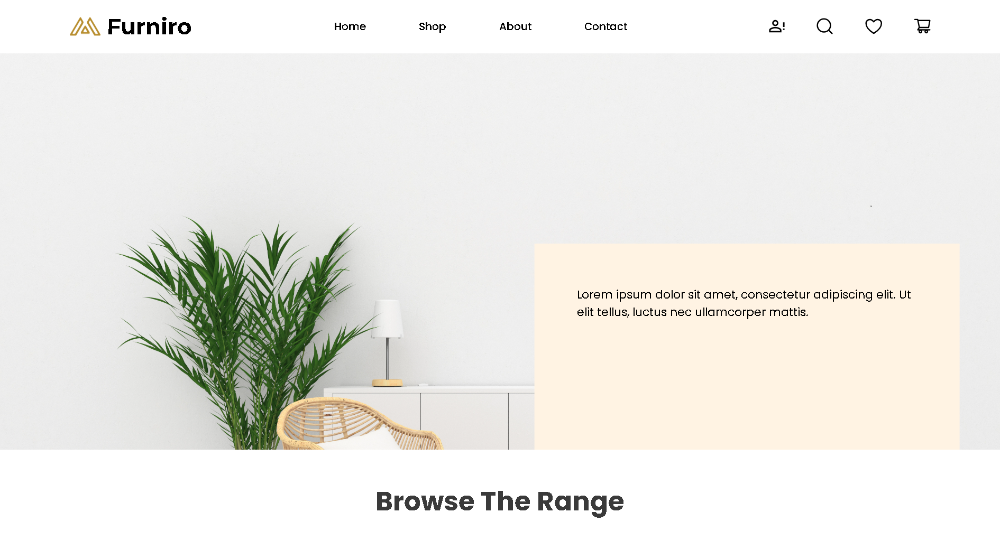
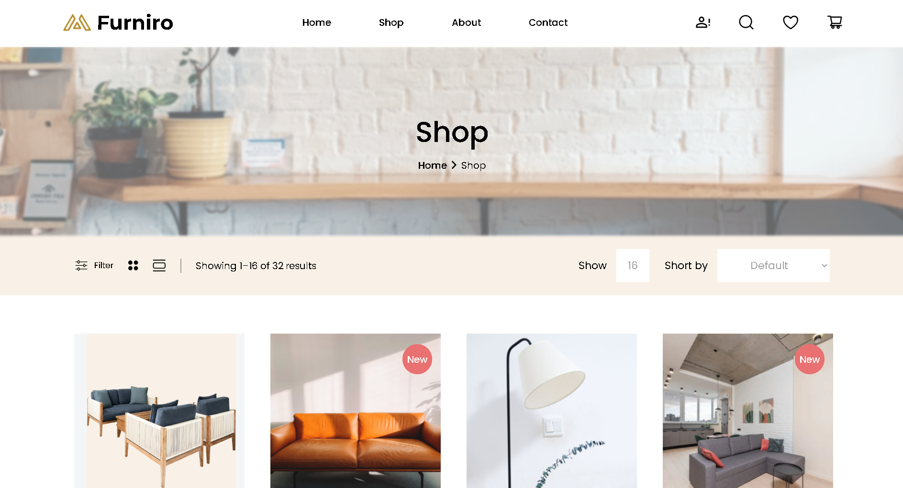
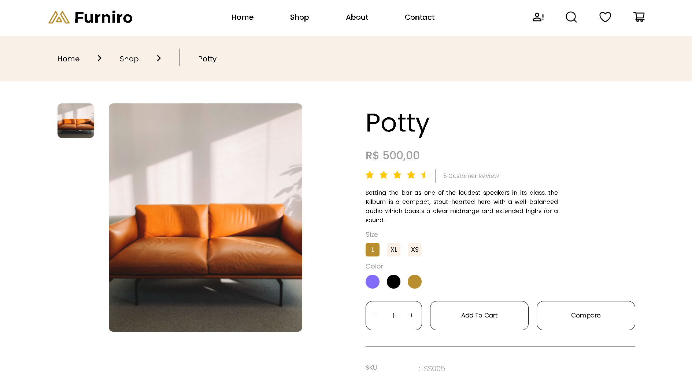

# compass-uol-desafio-3: Desenvolvendo um E-Commerce





> Desenvolver uma aplicação de e-commerce utilizando React para o frontend e NestJS para o backen.

## Tecnologias:

- Front-End:
    * React
    * Zustand
    * Sooner
    * React Hook From
- Back-End:
    * Nest
    * Prisma
    * Supabase

## 🚀 Executando o projeto: 

Para conseguir executar o projeto em sua máquina, é necessário:

1. Clonar o repositório
- Clone o projeto em sua máquina local:

```
git clone https://github.com/ThomazHilario/compass-uol-desafio-3.git
```

2. Configurar o Backend

- Entre na pasta do backend
```
cd backend-furniro
```

- Instale as dependências
```
npm install
```

- Inicie o servidor
```
npm run start:dev
```

3. Configurar o Frontend:

- Entre na pasta do frontend
```
cd frontend-furniro
```

- Instale as dependências
```
npm install
```

- Inicie o servidor de desenvolvimento
```
npm run dev
```

## Author:

<table>
  <tr>
    <td align="center">
      <a href="https://github.com/ThomazHilario" title="Repositório do Thomaz Alves">
        <br>
        <sub>
          <b>Thomaz Alves</b>
        </sub>
      </a>
    </td>
  </tr>
</table>

## 📝 Licença

Esse projeto está sob licença. Veja o arquivo [LICENÇA](LICENSE) para mais detalhes.
